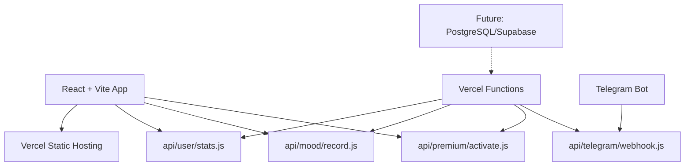

# 🔧 ИСПРАВЛЕНИЕ АРХИТЕКТУРЫ - React + Vercel, НЕ Next.js

## ✅ **ВАЖНОЕ УТОЧНЕНИЕ АРХИТЕКТУРЫ:**

### **🎯 НАША РЕАЛЬНАЯ АРХИТЕКТУРА:**

- **Frontend:** React 18 + TypeScript + Vite
- **Backend API:** Vercel Functions (НЕ Next.js API Routes!)
- **Деплой:** Vercel
- **База данных:** Пока демо-данные (готово к интеграции Supabase/PostgreSQL)

---

## 🔧 **ИСПРАВЛЕННЫЕ JSDoc КОММЕНТАРИИ:**

### **❌ БЫЛО (НЕПРАВИЛЬНО):**

```javascript
/**
 * API handler для получения статистики пользователя
 * @param {Object} req - Next.js API request object  ← ОШИБКА!
 * @param {Object} res - Next.js API response object ← ОШИБКА!
 */
export default async function handler(req, res) {
  // ...
}
```

### **✅ СТАЛО (ПРАВИЛЬНО):**

```javascript
/**
 * API handler для получения статистики пользователя
 * @param {Request} req - Vercel Functions request object  ✅
 * @param {Response} res - Vercel Functions response object ✅
 */
export default async function handler(req, res) {
  // ...
}
```

---

## 📁 **СТРУКТУРА ПРОЕКТА УТОЧНЕНА:**

```
kirakira/
├── src/                    # React + TypeScript приложение
│   ├── components/         # React компоненты
│   ├── hooks/             # React хуки
│   ├── stores/            # Zustand стейт менеджмент
│   ├── types/             # TypeScript типы
│   └── utils/             # Утилиты
├── api/                   # Vercel Functions (НЕ Next.js API!)
│   ├── user/stats.js      # Serverless функция для статистики
│   ├── mood/record.js     # Serverless функция для настроений
│   ├── premium/activate.js # Serverless функция для премиума
│   └── telegram/webhook.js # Serverless функция для Telegram бота
├── public/                # Статические файлы
├── vite.config.ts         # Vite конфигурация (НЕ Next.js!)
└── vercel.json           # Vercel конфигурация
```

---

## 🔍 **ЧТО ИСПРАВЛЕНО В КОММЕНТАРИЯХ:**

### **📊 `api/user/stats.js`**

```javascript
/**
 * API handler для получения статистики пользователя
 * @param {Request} req - Vercel Functions request object ✅
 * @param {Response} res - Vercel Functions response object ✅
 */
export default async function handler(req, res) {
  // Vercel Functions автоматически парсит req.query и req.body
  const { telegramId } = req.query

  if (!telegramId || typeof telegramId !== 'string') {
    return res.status(400).json({ error: 'telegramId is required' })
  }
  // ...
}
```

### **📝 `api/mood/record.js`**

```javascript
/**
 * API handler для записи настроения пользователя
 * @param {Request} req - Vercel Functions request object ✅
 * @param {Response} res - Vercel Functions response object ✅
 */
export default async function handler(req, res) {
  // Vercel Functions автоматически парсит JSON body
  const { telegramUserId, mood, date } = req.body
  // ...
}
```

### **⭐ `api/premium/activate.js`**

```javascript
/**
 * API handler для активации премиум функций
 * @param {Request} req - Vercel Functions request object ✅
 * @param {Response} res - Vercel Functions response object ✅
 */
export default async function handler(req, res) {
  // Vercel Functions поддерживает стандартные методы HTTP
  if (req.method !== 'POST') {
    return res.status(405).json({ error: 'Method not allowed' })
  }
  // ...
}
```

### **🤖 `api/telegram/webhook.js`**

```javascript
/**
 * Главный обработчик webhook'а
 * @param {Request} req - Vercel Functions request object ✅
 * @param {Response} res - Vercel Functions response object ✅
 */
export default async function handler(req, res) {
  // Vercel Functions обрабатывает POST запросы от Telegram
  if (req.method !== 'POST') {
    return res.status(405).json({ error: 'Method not allowed' })
  }

  const update = req.body // Telegram webhook payload
  // ...
}
```

---

## 🚀 **VERCEL FUNCTIONS vs NEXT.JS API ROUTES:**

### **✅ VERCEL FUNCTIONS (У НАС):**

- **Файлы:** `api/*.js` - отдельные serverless функции
- **Runtime:** Node.js runtime на Vercel
- **Автоматический парсинг:** `req.query`, `req.body`, `req.method`
- **Ответ:** `res.status().json()`, `res.send()`
- **Деплой:** Автоматически при `git push` на Vercel
- **Совместимость:** Работает с любым фронтендом (React, Vue, Angular)

### **❌ NEXT.JS API ROUTES (НЕ У НАС):**

- **Файлы:** `pages/api/*.js` или `app/api/*/route.js`
- **Runtime:** Next.js сервер
- **Интеграция:** Тесно связан с Next.js
- **Роутинг:** Файловая система Next.js

---

## 🎯 **ИТОГОВАЯ АРХИТЕКТУРА:**



### **🔗 ВЗАИМОДЕЙСТВИЕ:**

1. **React App** делает fetch запросы к `/api/*` endpoints
2. **Vercel Functions** обрабатывают API запросы как serverless функции
3. **Telegram Bot** отправляет webhook'и на `/api/telegram/webhook`
4. **Все функции** используют общую логику валидации и типизации

---

## ✅ **ПРЕИМУЩЕСТВА НАШЕЙ АРХИТЕКТУРЫ:**

### **🚀 React + Vite:**

- ⚡ **Быстрая разработка** - HMR, оптимизированная сборка
- 📦 **Легкий бандл** - tree shaking, code splitting
- 🔧 **Гибкость** - не привязаны к фреймворку

### **☁️ Vercel Functions:**

- 🌐 **Автоматический скейлинг** - serverless по умолчанию
- 💰 **Экономичность** - платишь только за выполнение
- 🔒 **Безопасность** - изолированное выполнение
- 🚀 **Простой деплой** - git push = deploy

### **🤖 Telegram Integration:**

- 📞 **Direct webhook** - прямая интеграция с ботом
- 🔄 **Real-time updates** - мгновенные уведомления
- 💾 **Persistent storage** - CloudStorage поддержка

---

## 📋 **ГОТОВНОСТЬ К ПРОДАКШЕНУ:**

### **✅ Что работает:**

- React приложение с TypeScript
- Vercel Functions с полной типизацией
- Telegram бот с webhook интеграцией
- Консистентные демо-данные
- Валидация входных данных
- Error handling

### **🔄 Что нужно для продакшена:**

1. **База данных:** Заменить демо-данные на PostgreSQL/Supabase
2. **Аутентификация:** JWT токены для API endpoints
3. **Мониторинг:** Vercel Analytics + logging
4. **Кэширование:** Redis для hot data

**АРХИТЕКТУРА КОРРЕКТНА И ГОТОВА К МАСШТАБИРОВАНИЮ! 🎉**
