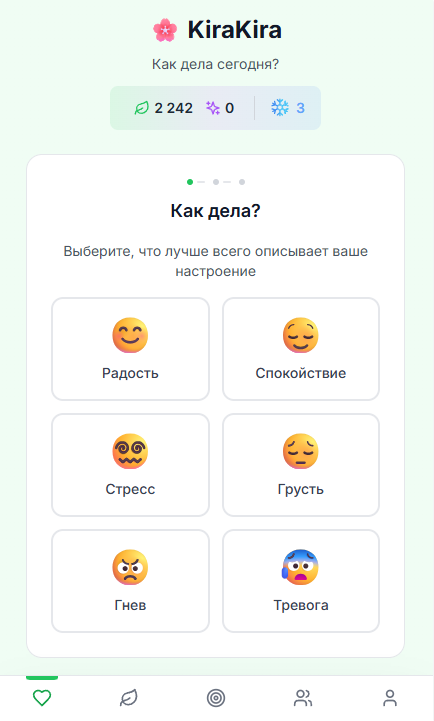
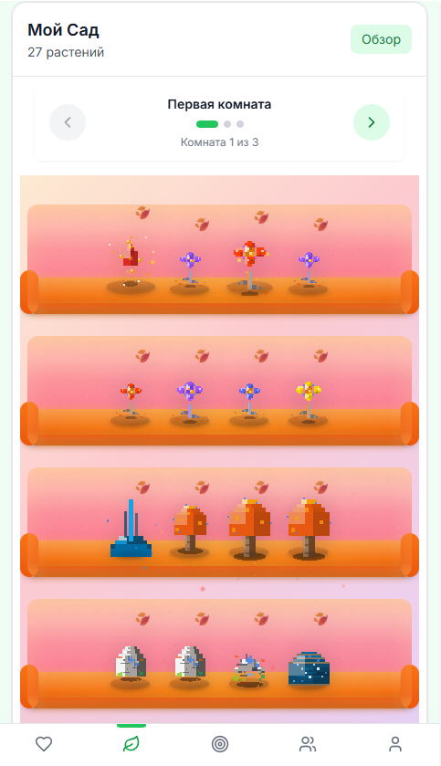
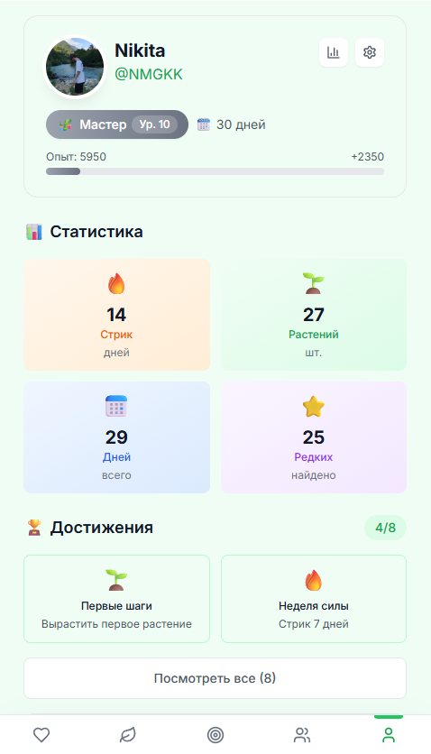
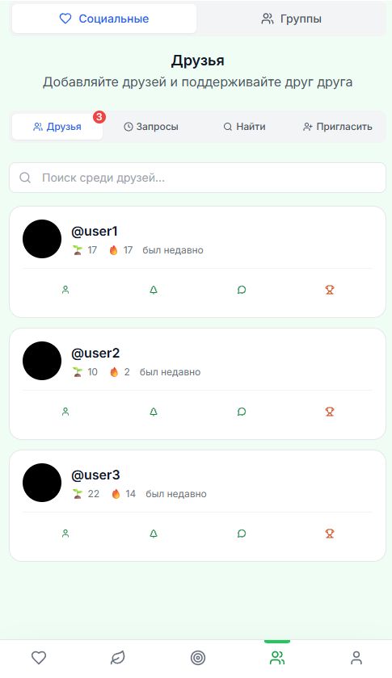

# KiraKira - Digital Emotional Garden

A meditative Progressive Web App (PWA) where your daily emotions bloom into a unique digital garden. Track your mood, watch your garden grow, and discover the beauty of emotional awareness through interactive plant elements.







## 🌸 About

KiraKira is a mindfulness application that transforms daily mood tracking into a beautiful, interactive experience. Each day you check in with your emotions, new elements appear in your personal digital garden, creating a visual representation of your emotional journey over time.

## ✨ Features

### 🌱 Garden System

- **Daily Element Generation**: New garden elements appear based on your daily mood
- **Mood-Based Elements**: 6 different mood types (Joy, Calm, Stress, Sadness, Anger, Anxiety) generate specific plant types
- **Rarity System**: Common, Uncommon, Rare, Epic, and Legendary elements with different visual styles
- **Seasonal Variants**: Elements change appearance based on current season
- **Room System**: Expandable garden with multiple rooms to accommodate growing collections
- **Element Upgrades**: Improve element rarity using in-game currency
- **Premium Elements**: Special elements available through Telegram Stars

### 😊 Mood Tracking

- **Daily Check-ins**: Track your mood with intensity levels (Low, Medium, High)
- **Visual Feedback**: Each mood type generates specific garden elements
- **Streak System**: Maintain daily check-in streaks for rewards
- **Mood Statistics**: View your emotional patterns and trends
- **Historical Timeline**: See how your garden reflects your emotional journey

### 🏆 Gamification

- **Achievement System**: Unlock achievements for various milestones
- **Experience Points**: Gain XP for daily check-ins and garden activities
- **Level System**: Progress through gardener levels with rewards
- **Daily Quests**: Complete daily challenges for bonus rewards
- **Currency System**: Earn and spend "Sprouts" for upgrades and themes

### 📱 Mobile-First Design

- **Progressive Web App**: Install as native app on mobile devices
- **Offline Support**: Works without internet connection
- **Touch-Friendly**: Optimized for mobile interactions
- **Responsive Design**: Adapts to all screen sizes

### 🤖 Telegram Integration

- **Telegram Mini App**: Available as @KiraKiraGardenBot
- **Cloud Sync**: Automatic data synchronization across devices
- **Theme Integration**: Respects Telegram's dark/light theme
- **Haptic Feedback**: Native feel with vibration feedback
- **Social Features**: Share gardens with friends
- **Premium Features**: Telegram Stars integration for special elements

## 🛠 Tech Stack

### Frontend

- **React 18+** with TypeScript 5.2+
- **Vite 5+** for fast development and optimized builds
- **React Router DOM 6+** for client-side routing
- **Framer Motion 10+** for smooth 60fps animations
- **Tailwind CSS 3+** for utility-first styling
- **Zustand 4+** for lightweight state management
- **TanStack React Query 5+** for server state management

### Backend & Services

- **Supabase** for backend services and database
- **Telegram Mini Apps API** for Telegram integration
- **Vite PWA Plugin** with Workbox for offline support

### Development Tools

- **Vitest** + **React Testing Library** for testing
- **ESLint** + **Prettier** for code quality
- **TypeScript** with strict configuration
- **Canvas Confetti** for celebration animations

## 🚀 Getting Started

### Prerequisites

- Node.js 18.0.0 or higher
- npm 8.0.0 or higher

### Installation

1. **Clone the repository**

   ```bash
   git clone https://github.com/your-username/kirakira.git
   cd kirakira
   ```

2. **Install dependencies**

   ```bash
   npm install
   ```

3. **Set up environment variables**

   ```bash
   cp .env.example .env.local
   ```

   Add your Supabase and Telegram bot credentials to `.env.local`

4. **Start development server**

   ```bash
   npm run dev
   ```

5. **Open in browser**
   Navigate to `http://localhost:3000`

### Available Scripts

- `npm run dev` - Start development server
- `npm run build` - Build for production
- `npm run preview` - Preview production build
- `npm run test` - Run tests
- `npm run test:ui` - Run tests with UI
- `npm run test:coverage` - Run tests with coverage
- `npm run lint` - Run ESLint
- `npm run lint:fix` - Fix ESLint issues
- `npm run type-check` - Run TypeScript type checking
- `npm run format` - Format code with Prettier

## 🏗 Project Structure

```
src/
├── components/          # Reusable UI components
│   ├── ui/             # Basic UI primitives
│   ├── garden/         # Garden-specific components
│   ├── mood/           # Mood tracking components
│   ├── profile/        # User profile components
│   ├── telegram/       # Telegram integration
│   └── dev/            # Development-only components
├── hooks/              # Custom React hooks
├── stores/             # Zustand state stores
├── utils/              # Utility functions
├── types/              # TypeScript type definitions
├── pages/              # Page components
└── styles/             # Global styles
```

## 🎨 Design System

### Color Palette

- **Primary**: Garden green tones (#10b981)
- **Mood Colors**:
  - Joy: Warm yellow (#fbbf24)
  - Calm: Cyan blue (#06b6d4)
  - Stress: Red (#ef4444)
  - Sadness: Blue (#3b82f6)
  - Anger: Dark red (#dc2626)
  - Anxiety: Purple (#8b5cf6)

### Typography

- **Font Family**: System fonts with fallbacks
- **Headings**: Bold weights for hierarchy
- **Body**: Regular weight for readability

### Animations

- **Framer Motion**: Smooth 60fps animations
- **Spring Physics**: Natural feeling transitions
- **Gesture Support**: Touch-friendly interactions
- **Accessibility**: Respects `prefers-reduced-motion`

## 🌐 Deployment

### Vercel (Recommended)

1. Connect your GitHub repository to Vercel
2. Set environment variables in Vercel dashboard
3. Deploy automatically on push to main branch

### Manual Deployment

1. Build the project: `npm run build`
2. Deploy the `dist` folder to your hosting provider
3. Configure environment variables

## 🤝 Contributing

1. Fork the repository
2. Create a feature branch: `git checkout -b feature/amazing-feature`
3. Commit your changes: `git commit -m 'Add amazing feature'`
4. Push to the branch: `git push origin feature/amazing-feature`
5. Open a Pull Request

## 📄 License

This project is licensed under the MIT License - see the [LICENSE](LICENSE) file for details.

## 🙏 Acknowledgments

- **Telegram** for the Mini Apps platform
- **Supabase** for backend services
- **Framer Motion** for smooth animations
- **Tailwind CSS** for utility-first styling
- **React** community for excellent tooling

## 📞 Support

For support, questions, or feedback:

- Open an issue on GitHub
- Contact us through Telegram: @KiraKiraGardenBot

---

Made with 🌸 by the KiraKira Team
